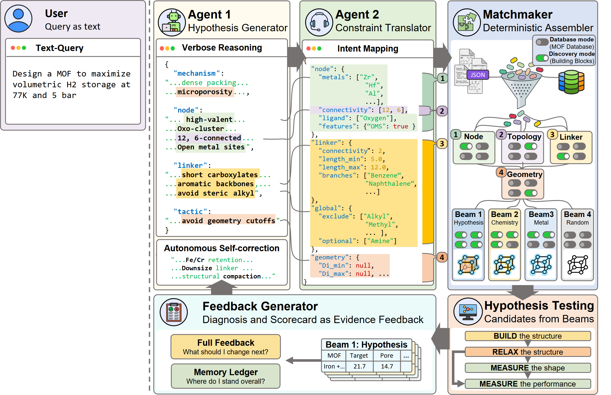

# LLM4MOF: Interpretable Inverse Design of MOFs with LLM Agents

A closed-loop multi-agent framework for inverse design of Metal–Organic Frameworks (MOFs).
Language-model agents (OpenAI GPT) propose interpretable design hypotheses, translate them into
searchable constraints, and refine them over ten autonomous iterations against either precomputed
MOF property databases (**database mode**) or a full live-simulation pipeline on HPC
(**discovery mode**: PORMAKE → LAMMPS → Zeo++ → RASPA3).

This repository accompanies the preprint *"Interpretable Inverse Design of Metal–Organic Frameworks
with Large Language Model Agents"* (Nam, Han, Kim).

## How it works

<p align="center">
   Agent 2 (constraints) -> Matchmaker -> four diagnostic beams -> hypothesis testing -> feedback">
</p>

The framework runs a **closed discovery loop** (Figure 1): **Agent 1** proposes an interpretable design hypothesis (metal nodes, linkers, target pore geometry); **Agent 2** translates it into searchable constraints; the **Matchmaker** deterministically assembles candidates and splits them into four diagnostic beams; each beam is evaluated by database lookup (**database mode**) or live simulation (**discovery mode**); and the **Feedback generator** returns blinded per-beam feedback plus a memory ledger. Agent 1 then refines its hypothesis — repeated for ten iterations.

The Matchmaker organizes candidates into a **4-beam diagnostic** that isolates which design axis drives
performance:

| Beam | Name | Constraints applied |
|------|------|---------------------|
| Beam 1 | Full hypothesis | Full hypothesis (geometry + chemistry + metal) |
| Beam 2 | Metal–linker chemistry | Chemistry only; geometry window removed |
| Beam 3 | Metal only | Metal only; linker and geometry unconstrained |
| Beam 4 | Random baseline | No hypothesis constraints; the full design space |

Within every beam, the baseline included, candidates are drawn round-robin across the distinct metals
present rather than in proportion to their abundance, so a rare metal is not crowded out by a common one
(`STRATIFIED_SAMPLING`, `STRATIFY_RANDOM_BEAM`; both default on, and the published runs used them). The
baseline therefore samples the whole design space under no hypothesis constraint, but not uniformly. In
discovery mode it is drawn uniformly over the generative space instead.

Beams are presented to Agent 1 under anonymized labels (internally `Z` / `A` / `F` / baseline) with
generic headers, so Agent 1 cannot infer which database is active or look up structures externally.

## Setup

### 1. Python environment

Requires **Python 3.10+**. Database mode needs only pure-Python packages, so any of `venv` + pip, `uv`,
or `conda` works — pick one:

```bash
# --- venv + pip ---
python -m venv llm4mof
llm4mof\Scripts\activate        # Windows   (macOS/Linux: source llm4mof/bin/activate)
pip install -r requirements.txt

# --- or uv (fast) ---
uv venv && uv pip install -r requirements.txt

# --- or conda ---
conda create -n llm4mof python=3.11 -y && conda activate llm4mof
pip install -r requirements.txt
```

`requirements.txt` is **database-mode only** and installs cleanly with no compiler or cluster.
Discovery / live-simulation mode needs extra Python packages **and** the external RASPA3 + LAMMPS
engines — see [`requirements-live.txt`](requirements-live.txt) and the "discovery mode" section below.
For that path **conda is recommended**, since RASPA3/LAMMPS are compiled binaries best obtained from
conda-forge or HPC modules (uv/pip cannot provide them).

### 2. API keys

Copy `.env.example` to `.env` and fill in your key. `.env` is git-ignored and never committed.

```bash
OPENAI_API_KEY=...
```

- OpenAI: https://platform.openai.com/api-keys

`LLM_PROVIDER` selects the vendor (`openai`, `gemini` or `claude`) and
`OPENAI_MODEL`, `GEMINI_MODEL` or `CLAUDE_MODEL` selects the model within it.
Both read from the environment, with defaults in `config.py`, which is how the
paper's backend comparison was run: the same loop, one variable changed.
`AGENT1_PROVIDER` and `AGENT2_PROVIDER` override the vendor for one agent, so a
backend can be varied for hypothesis generation while the constraint agent stays
pinned.

### 3. Large data files (Git LFS)

Four large files ship via **Git LFS**. After cloning:

```bash
git lfs install
git lfs pull
```

| File | Size | Purpose |
|------|------|---------|
| `core/mof2zeo/ckpt/epoch=487-step=1039440.ckpt` | 78 MB | MOF2Zeo geometry-prediction model |
| `data/hMOF/hmof_index.json` | 66 MB | hMOF gas-adsorption database |
| `data/qmof_index_v2.json` | 26 MB | QMOF band-gap index |
| `data/qmof.csv` | 21 MB | QMOF property table |

The six `data/total_characteristics_h2_*.csv` PORMAKE H₂ property tables are small and ship as normal
files (no LFS).

If the LFS quota is exhausted, the same files are available from the authors upon reasonable request —
see [`DATA.md`](docs/DATA.md).

## Usage — database mode (no cluster required)

```bash
python run_experiment.py
```

You choose a query from an 11-option menu: 4 PORMAKE H₂ targets (volumetric / gravimetric ×
5 / 100 bar), 4 hMOF gas-adsorption targets (CH₄, CO₂, Xe/Kr, H₂), 2 QMOF band-gap targets, or a
custom query. Unit and pressure are carried in the query text and routed to the correct database
automatically.

Non-interactive / batch:

```bash
python run_experiment.py --auto \
  --inquiry "Design a MOF to maximize volumetric H2 storage capacity at 77K and 100 bar." \
  --iterations 10 --database pormake
```

Useful flags: `--feedback-type N`, `--agent1-prompt <file>`,
`--pormake-unit {volumetric,molkg,gperL}`, `--pormake-pressure {5bar,100bar}`,
`--database {pormake,hmof,qmof}`, `--agent1-temp`, `--agent2-temp`.

### Output

Each run writes to `experiments/exp_YYYYMMDD_HHMM_{mode}/` with per-iteration `agent1_output.json`,
`agent2_output.json`, `beam_data.csv`, a feedback report, and the feedback text sent to Agent 1.

## Usage — discovery mode / live simulation (requires HPC)

`run_live_experiment.py` runs the full **PORMAKE → LAMMPS → Zeo++ → RASPA3** pipeline on an HPC
cluster (via SSH/qsub) instead of the precomputed property tables. This path **requires a configured
cluster** (RASPA3, LAMMPS, Zeo++, a PBS scheduler, and an SSH host entry); it is included for
transparency and reproducibility of the discovery-mode results, and is not runnable on a laptop.

Install the extra dependencies first (on top of `requirements.txt`):

```bash
pip install -r requirements.txt -r requirements-live.txt
# plus the external engines RASPA3 + LAMMPS — see requirements-live.txt
```

```bash
python run_live_experiment.py --hpc --pressure 5 \
  --inquiry "Design a MOF for high hydrogen storage at 5 bar and 77K" --iterations 10
```

Other live-mode flags: `--smoke` (quick validation), `--no-zeo`, `--adsorbate`, `--temperature`,
`--prepare` / `--collect` / `--resume` (step control), `--job-prefix`, `--node-prop`.

### Discovery domains

`--adsorbate` selects the simulation domain: `h2`, `ch4`, `co2`, `xekr`, `sf6`, `c2`.
The `c2` task runs an equimolar C₂H₆/C₂H₄ binary mixture scored as ethane selectivity
(TraPPE united-atom, chargeless by design); `sf6` uses the Dellis–Samios model
(see `core/simulation/gcmc/forcefield/`). The paper's discovery campaigns used these
exact inquiries, five replicates each:

| Domain | Flags | Inquiry |
|---|---|---|
| H₂, 77 K / 5 bar | `--adsorbate h2 --temperature 77 --pressure 5` | "Design a MOF to maximize volumetric H2 storage at 77K and 5 bar." |
| H₂, 160 K / 5 bar | `--adsorbate h2 --temperature 160 --pressure 5` | "Design a MOF to maximize volumetric H2 storage at 160K and 5 bar." |
| C₂H₆/C₂H₄, 298 K / 1 bar | `--adsorbate c2 --temperature 298 --pressure 1` | "Design a MOF to maximize C2H6/C2H4 selectivity at 298K and 1 bar." |
| SF₆, 298 K / 1 bar | `--adsorbate sf6 --temperature 298 --pressure 1` | "Design a MOF to maximize gravimetric SF6 uptake at 298K and 1 bar." |

HPC settings (host, base dir, scheduler) are in the `LIVE SIMULATION CONFIGURATION` section of
`config.py`. The cluster-side scripts live in `hpc/`; local orchestration lives in `core/hpc/`.

## Configuration highlights (`config.py`)

| Setting | Default | Description |
|---------|---------|-------------|
| `AGENT1_PROMPT_PATH` | `prompts/agent1_v3.0_production.md` | Active Agent 1 prompt |
| `AGENT2_PROMPT_PATH` | `prompts/agent2_v4.1.md` | Active Agent 2 prompt |
| `FEEDBACK_SAMPLE_SIZE` | 10 | Samples per beam |
| `STOCHASTIC_SAMPLING` | True | New samples each iteration |
| `STRATIFIED_SAMPLING` | True | Metal-stratified feedback sampling (env: `LLM2POR_STRATIFIED_SAMPLING`) |
| `USE_MEMORY_LEDGER` | True | Facts-only design-memory prepend (env: `LLM2POR_USE_MEMORY_LEDGER`) |

## Repository layout

```text
.
|-- run_experiment.py          # Database-mode entry point (interactive + batch)
|-- run_live_experiment.py     # Live HPC simulation entry point (discovery mode)
|-- config.py                  # Paths, models, unit/pressure routing, toggles
|-- setup.py  requirements.txt  requirements-live.txt
|-- core/                      # Runtime modules (agents, matchmaker, feedback, mof2zeo, simulation, hpc)
|-- prompts/                   # Active Agent 1 / Agent 2 prompts
|-- data/                      # Databases (large files via Git LFS)
|-- hpc/                       # Cluster-side scripts + HPC step helpers (run_prepare_step / run_collect_step)
|-- scripts/                   # build_canonical_db.py -- rebuilds the shipped data files
|-- source_data/               # The numbers behind every figure and table, and the reasoning traces
|-- paper/                     # Publication figures + figure-to-data map
`-- docs/                      # DATA.md (data manifest), PROVENANCE.md
```

## Code and data availability

- **Code** — this repository (MIT-licensed; see `LICENSE`).
- **Source data** — [`source_data/`](source_data/) holds the values behind every figure and table, the
  agent reasoning traces for both modes, the held-out split the geometry surrogate is evaluated on, and
  the structures the paper names as CIFs. [`source_data/MANIFEST.csv`](source_data/MANIFEST.csv) lists
  every file with the display item it supports, and `source_data/README.md` states the conventions.
- **Figures** — publication figures and a figure-to-data map are in [`paper/`](paper/).
- **Databases & model** — the three evaluation databases (PORMAKE, hMOF, QMOF) and the MOF2Zeo model
  checkpoint ship in-repo via Git LFS; see [`DATA.md`](docs/DATA.md) for the file manifest, integrity
  hashes, and the third-party database citations they derive from.
- **Experiment logs** — the raw closed-loop run logs (~1.6 GB) are orchestration records; the reasoning
  they contain is already in `source_data/` as the agent traces. The logs themselves are **available
  from the authors upon reasonable request**.

See [`PROVENANCE.md`](docs/PROVENANCE.md) for how this repository was derived. Licensed under MIT — see `LICENSE`.

## Citation

```bibtex
@article{nam2026llm4mof,
  title         = {Interpretable Inverse Design of Metal--Organic Frameworks with Large Language Model Agents},
  author        = {Nam, Kyungmin and Han, Seunghee and Kim, Jihan},
  journal       = {arXiv preprint arXiv:2606.29459},
  year          = {2026},
  eprint        = {2606.29459},
  archivePrefix = {arXiv}
}
```

Preprint: <https://arxiv.org/abs/2606.29459>
